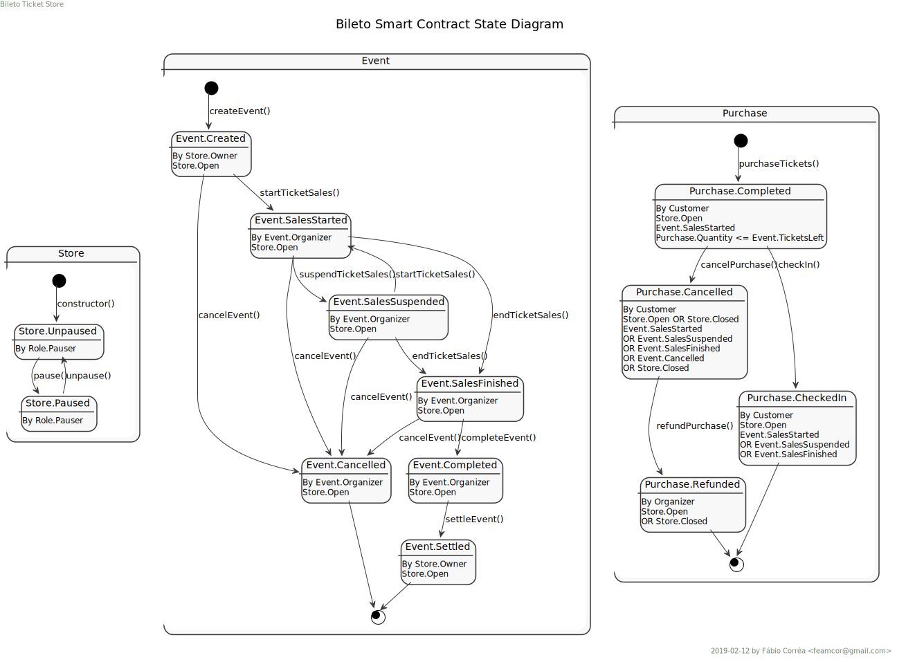

# BILETO

[Bileto](https://en.wiktionary.org/wiki/bileto) is a decentralized ticket store for the Ethereum blockchain.

- [BILETO](#bileto)
  - [Introduction](#introduction)
  - [Origins](#origins)
  - [High-Level Solution](#high-level-solution)
  - [Try Bileto](#try-bileto)
  - [Roles](#roles)
  - [States](#states)
    - [Store](#store)
    - [Event](#event)
    - [Purchase](#purchase)
  - [Events Emitted](#events-emitted)
    - [Inherited](#inherited)
    - [Internal](#internal)
  - [Best Practices](#best-practices)
  - [Smart Contract Installation](#smart-contract-installation)
  - [DApp Installation (development build)](#dapp-installation-development-build)
  - [DApp Installation (production build)](#dapp-installation-production-build)
  - [Future Enhancements](#future-enhancements)

## Introduction

**Bileto** is a set of smart contracts, written in [Solidity](https://solidity.readthedocs.io/en/v0.5.5/index.html) [0.5.5](https://github.com/ethereum/solidity/releases/tag/v0.5.5), which implement the business of a ticket store. It is accompanied by a decentralized [web3](https://blockchainhub.net/web3-decentralized-web)-enabled application ([DApp](https://ethereum.stackexchange.com/questions/383/what-is-a-dapp)) where users, according to their roles, can manage the store, its events and perform ticket purchases, cancellations, refunds and event check-in.

**Bileto** can be deployed to an [Ethereum](https://ethereum.org) blockchain, be it the public [mainnet](https://etherscan.io), a public testnet like [Rinkeby](https://rinkeby.etherscan.io), a private network, or on a local development blockchain like [Ganache](https://truffleframework.com/ganache).

As currency for ticket purchases, so far, Bileto uses Ethereum's native [Ether](https://www.ethereum.org/ether).

## Origins

**Bileto** was initially developed as [my](https://github.com/feamcor) [final project](https://github.com/dev-bootcamp-2019/final-project-feamcor) for the [ConsenSys Academy Developer Program Bootcamp](https://consensys.net/academy/bootcamp), cohort of [Fall/Winter 2018](https://courses.consensys.net/courses/course-v1:ConsenSysAcademy+2018DP+2/about).

This repo, as a way of learning and improving my skills on blockchain development, holds all the changes performed after the bootcamp: bug fixing, refactoring, new features, adoption of best practices and improvements on the user experience.

## High-Level Solution

TBD

## Try Bileto

Bileto is deployed to Rinkeby testnet (see it on [Etherscan](https://rinkeby.etherscan.io/)).
Its DApp is deployed to IPFS and can be accessed [here](#).

## Roles

Any account, at any time, can be associated to many roles. For instance, the store owner can purchase tickets to an event, turning the account also on a customer.

-   **Owner** - at a first moment, the store's Owner corresponds to the account who deployed the smart contract into the blockchain. Later on, the Owner can transfer ownership to another account. There is only one Owner and its impact on the contract is none (unless it is a Pauser) but to hold or withdraw the funds that are reserved to the maintenance and future development of the store's smart contract and DApp.
-   **Pauser** - corresponds to the accounts which are allowed to trigger the store's emergency stop mechanism. At a first moment, the store's Owner account is also the first Pauser account. A Pauser account can add another pausers (to share the burden), or it can renounce such role ([_with great power comes great responsibility_](https://en.wikipedia.org/wiki/Uncle_Ben)).
-   **Organizer** - corresponds to the accounts who created events on the store. Later on, such accounts can manage the event lifecycle: from starting to suspending or ending sales of tickets, plus completing or cancelling the event. Each event can only be managed by its Organizer account.
-   **Customer** - corresponds to the accounts who purchased tickets on the store. Later on, such accounts can check-in or request purchase cancellation and refund (when such conditions are allowed). Each purchase can only be managed by the account who completed the purchase (i.e. the Customer). Customer accounts must be an [EOA](https://ethereum.stackexchange.com/questions/5828/what-is-an-eoa-account).

## States

### Store

-   **Unpaused** - initial state of the store, meaning that it is open for business.
-   **Paused** - emergency stop state, where no actions can be run (that is, store is closed) until unpaused. It impacts all events managed by the store.

### Event

-   **Created** - event is created, but not yet selling tickets.
-   **Sales Started** - event is actively selling tickets (prior to event date).
-   **Sales Suspended** - event is temporarily not selling tickets (emergency stop).
-   **Sales Finished** - event is not selling tickets anymore (just before event date).
-   **Completed** - event happened successfully and funds are ready to be settled between store and organizer.
-   **Cancelled** - event is cancelled, allowing all purchases to be cancelled and/or refunded by customers.

### Purchase

-   Completed
-   Cancelled
-   Refunded
-   Checked-In

## Events Emitted

### Inherited

-   OwnershipTransferred
-   Paused
-   Unpaused
-   PauserAdded
-   PauserRemoved

### Internal

-   EventCreated
-   EventSalesStarted
-   EventSalesSuspended
-   EventSalesFinished
-   EventCompleted
-   EventSettled
-   EventCancelled
-   PurchaseCompleted
-   PurchaseCancelled
-   PurchaseRefunded
-   CustomerCheckedIn

## Best Practices

-   **[Reentrancy](https://www.dasp.co/#item-1)** - functions sensitive to reentrancy are guarded using OpenZeppelin [ReentrancyGuard](https://github.com/OpenZeppelin/openzeppelin-solidity/blob/master/contracts/utils/ReentrancyGuard.sol).
-   **[Access Control](https://www.dasp.co/#item-2)** - TBD
-   **[Arithmetic Issues](https://www.dasp.co/#item-3)** - arithmetic operations are checked against over or underflow using OpenZeppelin [SafeMath](https://github.com/OpenZeppelin/openzeppelin-solidity/blob/master/contracts/math/SafeMath.sol).

## Smart Contract Installation

TBD

## DApp Installation (development build)

TBD

## DApp Installation (production build)

TBD

## Future Enhancements

**Note:** the following list doesn't imply on order of implementation.

-   [x] Replace Store emergency stop by OpenZeppelin [Pausable](https://github.com/OpenZeppelin/openzeppelin-solidity/blob/master/contracts/lifecycle/Pausable.sol).
-   [ ] Introduce explicit roles by OpenZeppelin [Roles](https://github.com/OpenZeppelin/openzeppelin-solidity/blob/master/contracts/access/Roles.sol).
-   [ ] Use an Oracle to bring data from external sources.
-   [ ] Turn Bileto into a [DAO](https://en.wikipedia.org/wiki/Decentralized_autonomous_organization).
-   [ ] Allow different kinds of tickets, with distinct prices.
-   [ ] Allow assignment of seats.
-   [ ] Allow to increase or decrease number of tickets available for sale.
-   [ ] Allow multiple accounts to manage the store subject to multi-sig protocol.
-   [ ] Allow multiple accounts to manage an event subject to multi-sig protocol.
-   [ ] Allow store balance to be distributed to many accounts.
-   [ ] Allow event balance to be distributed to many accounts.
-   [ ] Split contract between store and events.
-   [ ] Replace store currency from Ether to an [ERC-20](https://theethereum.wiki/w/index.php/ERC20_Token_Standard) utility token or to a stablecoin like [DAI](https://makerdao.com/en/dai).
-   [ ] Integrate customer identification with uPort or other identity provider.
-   [ ] Turn tickets into [ERC-721](https://eips.ethereum.org/EIPS/eip-721) NFT deeds.
-   [ ] Could ticket validation during check-in benefit of ZK-proof like zkSNARKS or even zkSTARKS?
        _etc._
